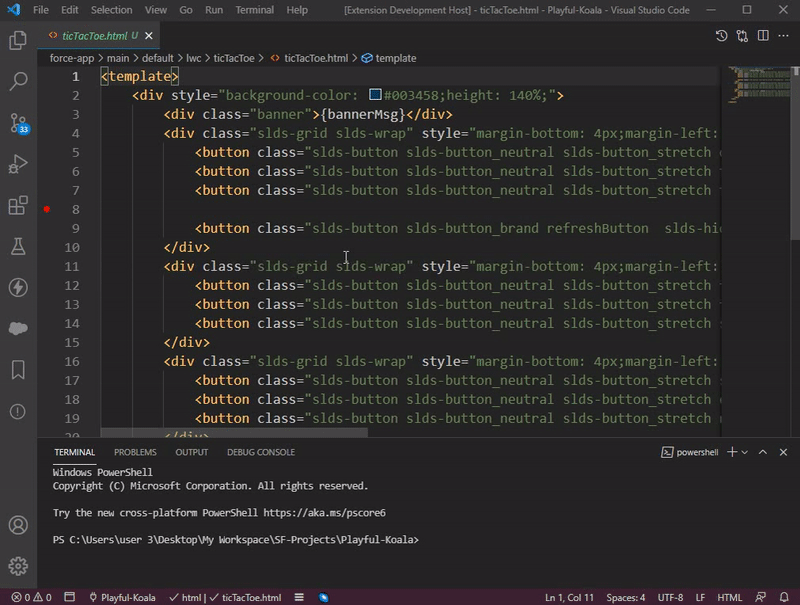
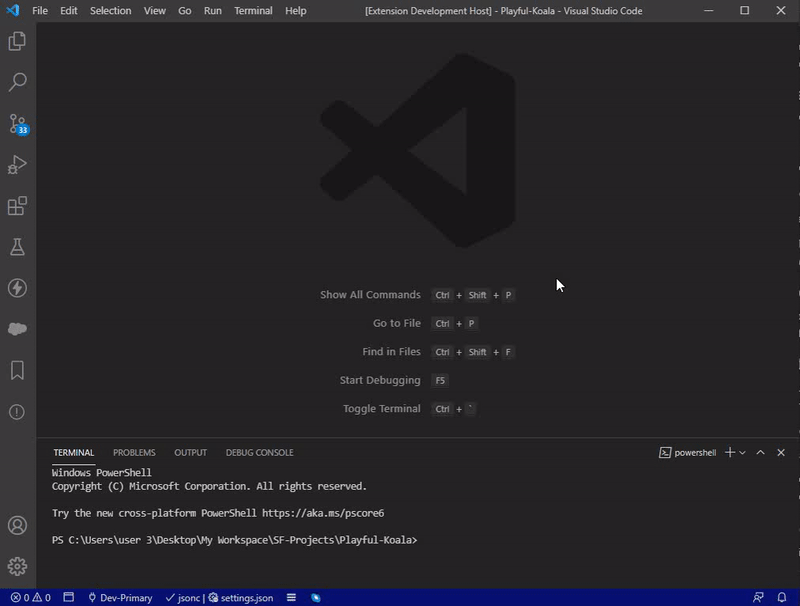

# salesforce-org-indicator README

Its Always painful when you accidentally Pushed an Apex Class over a different Salesforce Org through VSCode. This generally happens when you are working over several different Sandboxes.  

To make it easier to visualize which Org you are working on Salesforce Org Indicator can provide color indicator over the VSCode Status Bar for different Authorized Salesforce Orgs.

## Features

> SOI: Set Indicator For Current ORG   

 

Using this command you can set color for your current set Org.

 

            

> SOI: Refresh Indicator For Current ORG

 

This command also runs on Startup of the VSCode so will handle the Org color at beginning. After you change the Org you can either use this command or can click over the Status bar icon shown in below gif.

 

 

## Requirements

> Salesforce Extension for VSCode is required to run this extension and it only works on the valid SFDX projects with an Authorize Org.

 

## License
MIT License
